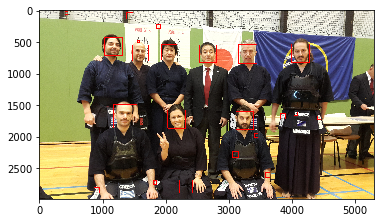
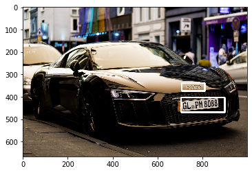

# object_detection-opencv

Here I usend opencv to implement face detector, eyes detector, face & eye together, pedestrian, car detector and car plate detector. I did not train any ML model. For all detection I used opencv trerained model `haarcascade`. The name of the classifiers are    
+ `haarcascade_frontalface_default.xml`
+ `haarcascade_eye.xml`
+ `haarcascade_fullbody.xml`
+ `haarcascade_car.xml`
+ `haarcascade_plate_number.xml`    

The models are available in the `Haarcascades` folder. For detection the images and video what I used can be found from `Images` and `Video` folder. For more info check the 1st notebook.    

Some images from note is provided here     

